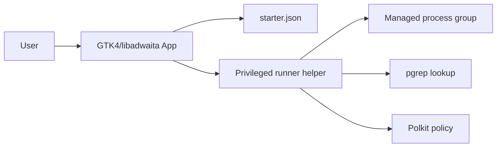
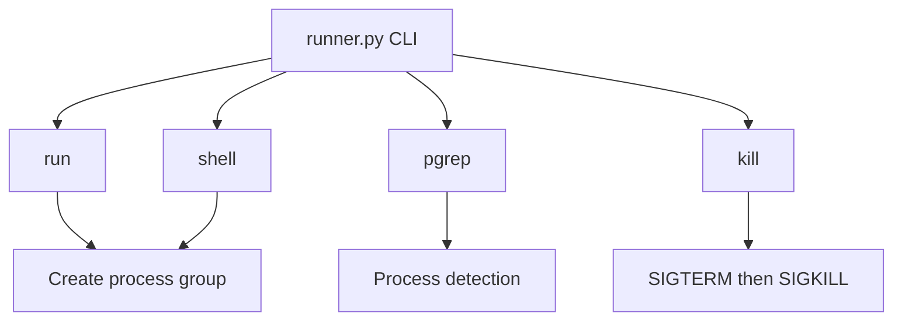
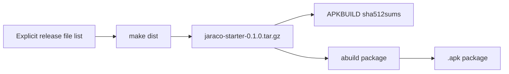
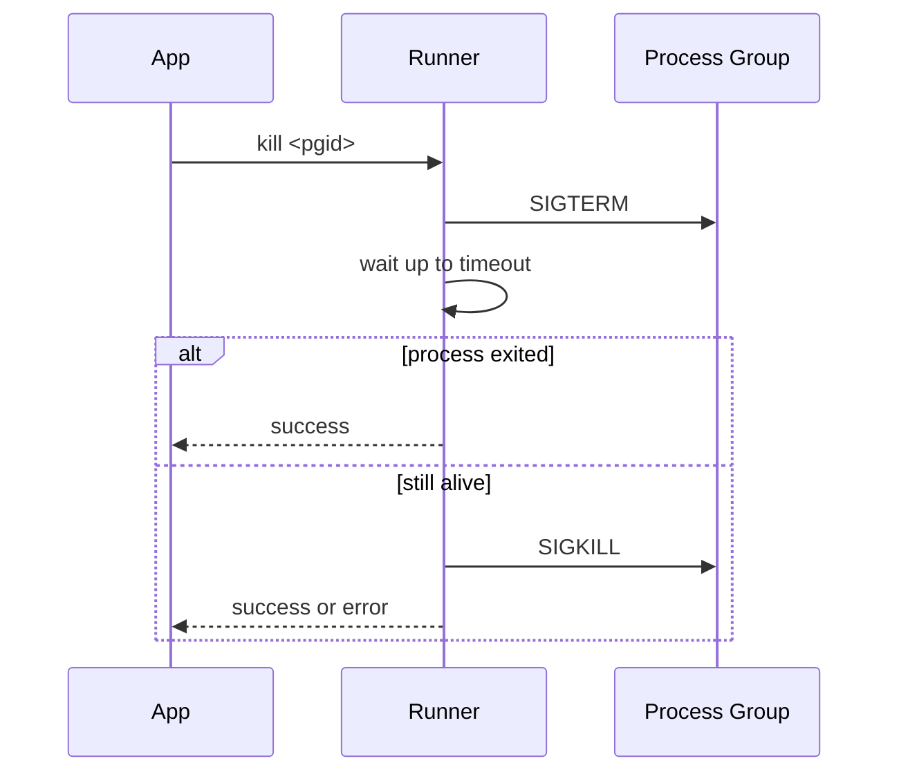
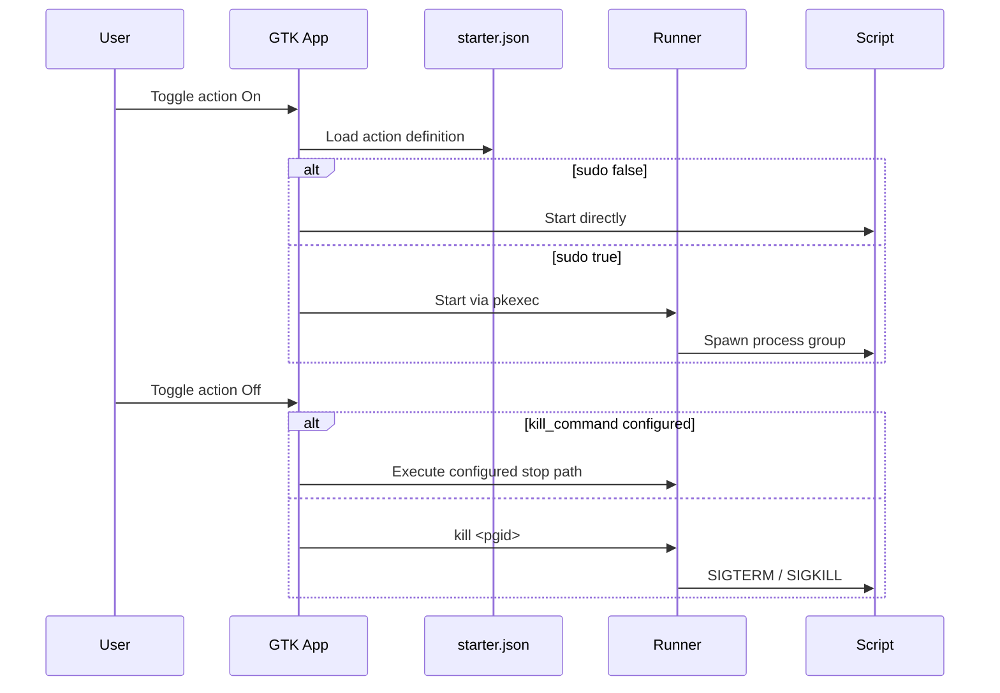

# Jaraco Starter

Jaraco Starter is a small postmarketOS-oriented launcher intended to expose
configured actions in a GTK4/libadwaita UI and start or stop the corresponding
processes. The repository currently contains the packaging scaffold, release
automation, Alpine `APKBUILD`, and the privileged `runner.py` helper used for
process control.

## Status

Current repository state:

- Packaging and CI are implemented.
- The privileged helper at `src/jaraco_starter/runner.py` is implemented.
- Tests currently cover the runner helper.
- The full GTK application described in `spec.md` is planned architecture and is
  not fully present in this repository yet.

## Features

- JSON-driven action model for launcher entries.
- Privileged process execution support through `pkexec` and Polkit.
- Deterministic source tarball generation via `make dist`.
- Alpine packaging via `APKBUILD`.
- GitHub Actions workflows for Python build validation and Alpine package checks.

## Configuration

Primary config path:

```text
~/.config/jaraco/starter.json
```

Example configuration:

```json
{
  "actions": [
    {
      "name": "Tor",
      "script": "/usr/bin/tor",
      "sudo": true
    },
    {
      "name": "Notes Sync",
      "script": "/home/user/bin/notes-sync.sh",
      "sudo": false
    }
  ]
}
```

Optional action fields planned by the spec:

- `kill_command`
- `kill_sudo`

Operational notes:

- Scripts should be executable and include a shebang.
- When `sudo` is `true`, the intended app flow uses `pkexec`.
- The runner helper manages process groups so the application can stop the exact
  launched process tree.

## Repository Layout

```text
.
├── .github/workflows/
│   ├── alpine-package.yml
│   └── ci.yml
├── data/
│   ├── io.jaraco.Starter.desktop
│   ├── io.jaraco.Starter.metainfo.xml
│   ├── io.jaraco.Starter.policy
│   └── io.jaraco.Starter.svg
├── src/jaraco_starter/
│   ├── __init__.py
│   └── runner.py
├── tests/
│   └── test_runner.py
├── APKBUILD
├── Makefile
├── pyproject.toml
├── setup.py
└── starter.sample.json
```

## Architecture

The intended runtime architecture is:



The current implemented helper architecture is:



Release and packaging flow:



## Runner Helper

`src/jaraco_starter/runner.py` provides a small CLI used for privileged process
management.

Supported subcommands:

- `run <cmd...>`: start a command in a new process group and print the PGID.
- `shell <command>`: start `/bin/sh -c <command>` in a new process group and
  print the PGID.
- `pgrep [--full] <pattern>`: proxy to `pgrep -x` or `pgrep -f`.
- `kill <pgid> [--timeout 3.0]`: send `SIGTERM`, wait, then escalate to
  `SIGKILL` if the process group is still alive.

Process termination behavior:



## Build and Test

### Python build validation

The generic CI workflow in [.github/workflows/ci.yml](/home/user/Documents/projects/starter/.github/workflows/ci.yml) does the following:

- checks out the repository
- sets up Python 3.11
- installs `build`, `twine`, and `pytest`
- runs `python -m build`
- runs `python -m twine check dist/*`
- runs `make dist`
- runs `pytest -q` when tests are present

Equivalent local commands:

```sh
python -m pip install --upgrade pip
python -m pip install build twine pytest
python -m build
python -m twine check dist/*
make dist
pytest -q
```

### Alpine packaging validation

The Alpine workflow in [.github/workflows/alpine-package.yml](/home/user/Documents/projects/starter/.github/workflows/alpine-package.yml) runs inside an `alpine:3.20` container and:

- installs Alpine build dependencies
- runs `make dist`
- validates `APKBUILD` shell syntax
- verifies required packaging files exist
- confirms the generated tarball checksum matches `APKBUILD`

Equivalent local commands on Alpine:

```sh
apk add --no-cache bash make tar coreutils python3 py3-setuptools
make dist
sh -n APKBUILD
pkgname="$(awk -F= '/^pkgname=/{print $2}' APKBUILD | tr -d '"')"
pkgver="$(awk -F= '/^pkgver=/{print $2}' APKBUILD | tr -d '"')"
tarball="dist/${pkgname}-${pkgver}.tar.gz"
expected="$(sed -n '/^sha512sums="/,/^"$/p' APKBUILD | grep "  ${pkgname}-${pkgver}.tar.gz$" | awk '{print $1}' | head -n 1)"
actual="$(sha512sum "$tarball" | awk '{print $1}')"
test -n "$expected"
test "$expected" = "$actual"
```

## Deterministic Release Tarball

`make dist` intentionally creates a deterministic archive. The tarball is built
from an explicit file list in `Makefile` and normalizes:

- file order
- modification time
- owner and group
- numeric owner values
- file mode bits
- gzip metadata

This is required so the tarball checksum stored in `APKBUILD` matches the tarball
generated in both local and CI environments.

## Local Build

Create the source tarball:

```sh
make dist
```

The output file is:

```text
dist/jaraco-starter-0.1.0.tar.gz
```

Build the Alpine package:

```sh
make abuild
```

Optional sample config install:

```sh
make install-sample
```

## Installation

### Runtime dependencies on Alpine or postmarketOS

From `APKBUILD`, the application depends on:

- `python3`
- `py3-gobject3`
- `gtk4.0`
- `libadwaita`
- `polkit`

Build dependency:

- `py3-setuptools`

Install dependencies only if missing:

```sh
required="python3 py3-gobject3 gtk4.0 libadwaita polkit"
for pkg in $required; do
  if apk info -e "$pkg" >/dev/null 2>&1; then
    echo "OK: $pkg already installed"
  else
    sudo apk add "$pkg"
  fi
done

if ! apk info -e py3-setuptools >/dev/null 2>&1; then
  sudo apk add py3-setuptools
fi
```

### Install from local package repository

```sh
echo "/home/user/packages/test" | sudo tee -a /etc/apk/repositories
sudo apk update
sudo apk add jaraco-starter
```

### Install directly from a built APK

```sh
sudo apk add --allow-untrusted /home/user/packages/test/aarch64/jaraco-starter-0.1.0-r0.apk
```

## Packaging Details

`APKBUILD` installs the following package outputs:

- Python package files under `/usr`
- runner helper at `/usr/lib/jaraco-starter/runner`
- desktop entry under `/usr/share/applications/`
- metainfo under `/usr/share/metainfo/`
- icon under `/usr/share/icons/hicolor/scalable/apps/`
- Polkit policy under `/usr/share/polkit-1/actions/`
- sample config under `/usr/share/jaraco-starter/starter.sample.json`

Packaging install flow:

```mermaid
flowchart TD
    APKBUILD[APKBUILD package()] --> Setup[python3 setup.py install --root pkgdir --prefix /usr]
    APKBUILD --> Runner[/usr/lib/jaraco-starter/runner]
    APKBUILD --> Desktop[/usr/share/applications]
    APKBUILD --> Meta[/usr/share/metainfo]
    APKBUILD --> Icon[/usr/share/icons/hicolor/scalable/apps]
    APKBUILD --> Policy[/usr/share/polkit-1/actions]
    APKBUILD --> Sample[/usr/share/jaraco-starter]
```

## Intended Full Application Design

The spec in `spec.md` describes the target application behavior beyond the
currently implemented helper:

- a GTK4/libadwaita UI listing actions with `Off` and `On` controls
- first-run config seeding
- process detection for existing actions
- privileged execution through `pkexec`
- optional `kill_command` support
- error reporting through the UI

Intended control flow:



## Validation

Current validation in this repository covers:

- Python packaging metadata
- deterministic source tarball generation
- `APKBUILD` checksum integrity
- runner helper unit tests

Once the full GTK application is added, the README should be updated to document
the GUI entry point, runtime screenshots, and end-to-end behavior.
